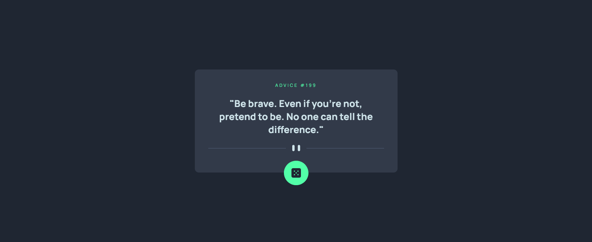

# Frontend Mentor - Advice generator app solution

This is a solution to the [Advice generator app challenge on Frontend Mentor](https://www.frontendmentor.io/challenges/advice-generator-app-QdUG-13db). Frontend Mentor challenges help you improve your coding skills by building realistic projects.

## Table of contents

- [Overview](#overview)
  - [The challenge](#the-challenge)
  - [Screenshot](#screenshot)
  - [Links](#links)
- [My process](#my-process)
  - [Built with](#built-with)
  - [What I learned](#what-i-learned)
  - [Continued Development](#continued-development)
- [Author](#author)
- [Acknowledgments](#acknowledgments)

## Overview

### The challenge

The challenge is to build out this advice generator app using the Advice Slip API and get it looking as close to the design as possible.

Users should be able to:

- View the optimal layout for the app depending on their device's screen size
- See hover states for all interactive elements on the page
- Generate a new piece of advice by clicking the dice icon

### Screenshot

### Links

- Solution URL: [Advice generator app Code](https://github.com/jaireid/Advice-Generator-App.git)
- Live Site URL: [Advice generator app Site](https://jaireid.github.io/Advice-Generator-App/)

## My process

### Built with

- Semantic HTML5 markup
- Flexbox
- CSS custom properties
- CSS media queries
- Mobile-first workflow
- Fetch API

### What I learned

This project helped me learn about the CSS position property and Fetch API.

### Continued Development

In future updates, I plan on working on the responsiveness and the positioning of the dice icon. Enclosing the icon with absolute position in a container with a fixed width and relative position may make the icon more responsive.

### Useful resources

- [Tailwind CSS Customizing Screens](https://tailwindcss.com/docs/screens) - This Tailwind CSS documentation about customizing screens helped me with learning breakpoints and how to use them in a project.
